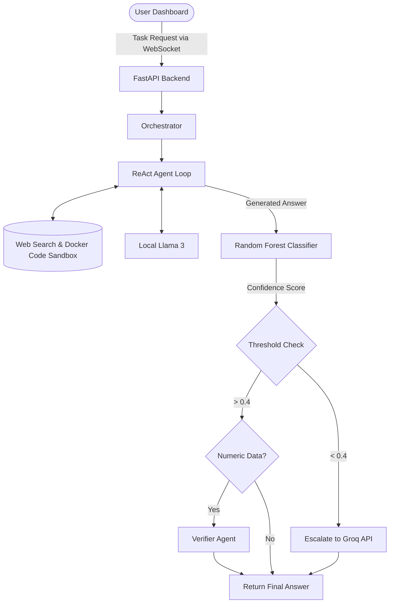

# ConfidenceRoute

**ConfidenceRoute: Adaptive Multi-Agent Orchestration for Cost-Aware LLM Task Execution**

## 🚀 Overview
When multiple AI agents collaborate, existing frameworks force you to pre-define the exact sequence and model for every step. This leads to wasted resources (using expensive models for trivial tasks) and silent failures (bad outputs flowing downstream without detection).

**ConfidenceRoute** is a "smart manager" orchestrator that dynamically decides the execution path at runtime. It uses a trained Machine Learning model (Random Forest) to score agent outputs. Based on the confidence score, the Orchestrator can:
- **Proceed** if the answer is highly confident.
- **Retry** the step with the same model.
- **Escalate** to a more capable, expensive model (e.g., Mixtral 70B via Groq) if the local model struggles.
- **Insert dynamic steps**, like a VerifierAgent if numerical claims are detected.

## 🏗️ Architecture



## 🛠️ Tech Stack
- **Backend**: Python 3.11+, FastAPI, Docker (for sandboxed execution)
- **AI/LLMs**: Ollama (Llama 3 8B), ReAct prompting
- **Machine Learning**: Scikit-Learn (Random Forest), Pandas
- **Frontend**: React (Vite), WebSockets
- **Deployment**: Docker Compose

## 🚀 How to Run

### Prerequisites
1. **Docker Desktop** installed and running.
2. **Ollama** installed locally.
3. Pull the local LLM model:
   ```bash
   ollama run llama3:8b
   ```

### Option 1: Docker Compose (Recommended)
You can start the entire stack (FastAPI backend + React frontend) with a single command:

```bash
docker-compose up --build
```
- The React Dashboard will be available at: `http://localhost:5173`
- The FastAPI Backend will be available at: `http://localhost:8000`

### Option 2: Run Manually

**1. Start the Backend API:**
```bash
# In terminal 1
cd backend
source ../.venv/bin/activate
pip install -r requirements.txt
export PYTHONPATH=.
uvicorn api.main:app --reload --host 0.0.0.0 --port 8000
```

**2. Start the Frontend Dashboard:**
```bash
# In terminal 2
cd frontend
npm install
npm run dev
```

## 📊 Evaluation & Results
The pipeline is benchmarked against a static baseline using the **HotpotQA** dataset. The Random Forest classifier was trained on the `HaluEval` dataset and achieved a **97% F1 Score**, allowing the orchestrator to accurately predict hallucinated or weak answers and correct course dynamically. 

To run the benchmarking script yourself:
```bash
cd backend
python evaluation/run_benchmark.py
```
This produces a `benchmark_results.json` comparing step counts and execution patterns between the static pipeline and ConfidenceRoute.
